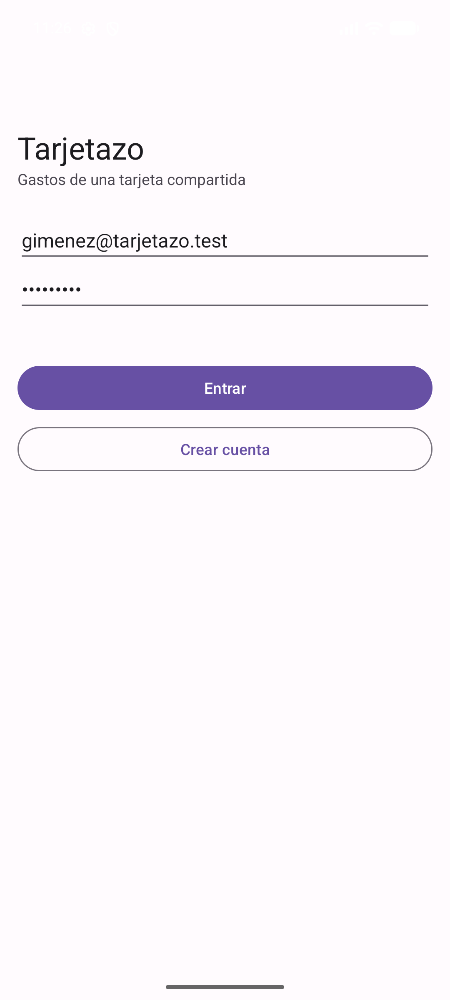
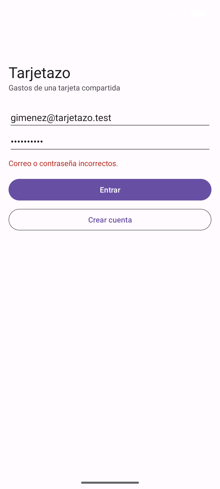
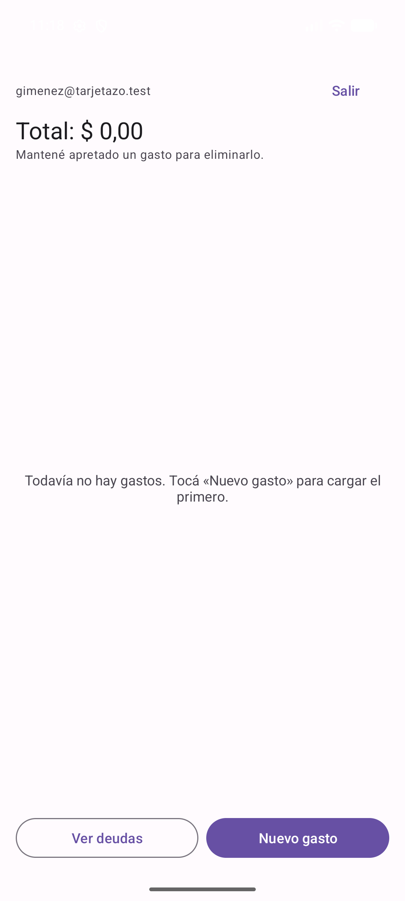
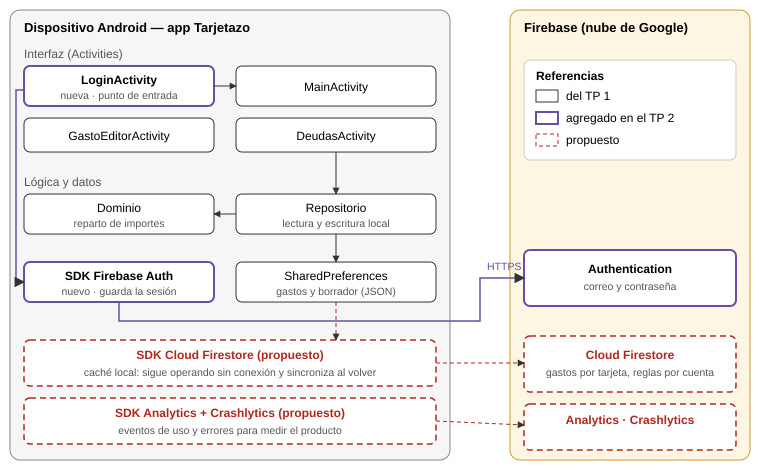

# Trabajo Práctico 2 — Producto mínimo viable

**Cátedra:** Arquitecturas Móviles — UTN Facultad Regional San Francisco
**Profesor:** Ing. Juan Pablo Bono
**Alumnos:** Martiniano Gimenez, Fabricio Quinteros
**Aplicación:** Tarjetazo — gastos de una tarjeta de crédito compartida
**Repositorio:** <https://github.com/FabriQuinteros/tp1-arquitecturas-moviles>

---

## 1. Definición del producto mínimo viable

**Hipótesis.** El titular de una tarjeta compartida prefiere anotar cada gasto en el
momento, con su división, antes que reconstruir a fin de mes quién gastó qué.

**Qué se construye.** Lo mínimo para ponerla a prueba:

| Incluido | Motivo |
|----------|--------|
| Cuenta con correo y contraseña | Cada titular entra con su cuenta; base para sincronizar más adelante. |
| Cargar un gasto: comercio e importe | Es la acción que se repite; tiene que llevar segundos. |
| Dividirlo por porcentaje entre personas | Es lo que la distingue de una planilla. |
| Ver cuánto debe cada persona y compartirlo | Es el resultado que el titular necesita a fin de mes. |

**Qué queda afuera:** invitar colaboradores, sincronizar entre dispositivos, cuotas,
gastos en dólares, categorías e importar el resumen del banco. Ninguna hace falta para
saber si la hipótesis se sostiene.

**Cómo se mide.** La hipótesis se sostiene si al menos dos de cada tres participantes
cargan un gasto dividido sin ayuda y en menos de un minuto, y dicen que lo usarían en lugar
de lo que hacen hoy.

## 2. Construcción

La aplicación del primer trabajo práctico se toma como base y se le agrega el ingreso con
**Firebase Authentication** (correo y contraseña):

- `LoginActivity` es el nuevo punto de entrada. Si ya hay una sesión abierta pasa
  directo a los gastos; si no, pide correo y contraseña, y permite crear la cuenta.
- `MainActivity` muestra la cuenta activa y la opción **Salir**. Si la sesión se cierra,
  vuelve al ingreso.
- Los errores de Firebase llegan en inglés y con jerga técnica, así que se traducen a
  mensajes claros: credenciales incorrectas, cuenta ya existente y falta de conexión.
- El SDK de Firebase guarda la sesión en el dispositivo, así que no hace falta volver a
  ingresar cada vez que se abre la app.

Capturas del emulador (Pixel 7): ingreso, contraseña equivocada y sesión abierta.

  

## 3. Medición y aprendizaje

### 3.1 Guion de la prueba

Cada participante usa la app en un teléfono sin explicación previa. Quien conduce la prueba
lee cada tarea, toma el tiempo y anota dónde se traba, sin ayudar.

1. Crear una cuenta y entrar.
2. Cargar un gasto de 12.000 pesos en «Supermercado», dividido en partes iguales con otra
   persona.
3. Ver cuánto debe cada persona y compartirlo por mensaje.
4. Eliminar el gasto.
5. Salir de la cuenta y volver a entrar.

Al final se le pregunta: *¿Lo usarías en lugar de lo que hacés hoy? ¿Qué te faltó?*

### 3.2 Resultados

Participaron dos personas que comparten una tarjeta de crédito, de 48 y 21 años, con la
app instalada en un teléfono.

| Participante | Tareas completas sin ayuda | Tiempo de la tarea 2 | Dónde se trabó | ¿Lo usaría? |
|--------------|----------------------------|----------------------|----------------|-------------|
| 1 (48 años) | 3 de 5 | 2 min 47 s | Crear la cuenta; escribir la división con el formato pedido. Creyó que los textos de ejemplo de los campos eran datos ya cargados. | Sí, para centralizar los gastos. |
| 2 (21 años) | 3 de 5 | 1 min 30 s | Crear la cuenta: no entendió que el mismo formulario sirve para ingresar y para registrarse. No supo cómo dividir el gasto. | Sí, con una interfaz más actual. |

Lo que pidieron mejorar:

- Una forma más visual de dividir el gasto, con otros componentes en lugar de texto libre.
- Mensajes más claros cuando algo está mal.
- Una pantalla de ingreso que distinga entrar de crear una cuenta, y una interfaz más
  actual en general.

### 3.3 Análisis

**El problema es real.** Las dos personas comparten una tarjeta y las dos usarían la app.
La de 48 años lo resumió como «centralizar los gastos», que es exactamente lo que hoy
hace de memoria el titular.

**La forma de resolverlo, todavía no.** Ninguna de las dos cargó un gasto dividido sin
ayuda, y el umbral era dos de cada tres en menos de un minuto. Las dos se trabaron en los
mismos dos lugares, lo que descarta que fuera algo de una persona:

1. **El ingreso.** «Crear cuenta» usa los campos de arriba en lugar de abrir un formulario
   propio. Las dos esperaban otra pantalla; con los campos vacíos, la app responde
   «Correo inválido» y parece que el botón no funciona.
2. **La división.** Escribir `Nombre: porcentaje`, una persona por línea, exige leer y
   respetar un formato. El ejemplo gris del campo, `Ana: 50 / Beto: 50`, se confundió con
   datos ya cargados.

Ver las deudas, compartirlas, eliminar un gasto y salir de la cuenta salieron sin ayuda:
el resto del flujo se sostiene.

### 3.4 Cambios para la próxima iteración

| Hallazgo | Cambio |
|----------|--------|
| Crear cuenta y entrar se confunden | Dos pestañas, «Entrar» y «Crear cuenta», cada una con su propio botón. |
| «Correo inválido» con los campos vacíos | Mensajes que digan qué hacer: «Escribí tu correo y una contraseña de al menos 6 caracteres». |
| La división en texto libre no se entiende | Una fila por persona, con su nombre y un control deslizante de porcentaje, más un botón «Partes iguales». La app muestra cuánto falta para llegar a 100. |
| El ejemplo del campo parece un dato cargado | Etiquetas fijas sobre cada campo en lugar de textos de ejemplo dentro. |

## 4. Arquitectura actualizada

Las pruebas cambian la interfaz pero no la arquitectura. Respecto del primer trabajo práctico se agregan el SDK de Firebase Authentication en el
dispositivo y el servicio de Authentication en la nube. La app se comunica con él por
HTTPS solo para ingresar o crear la cuenta. Los gastos siguen guardados en el dispositivo,
así que la carga funciona sin conexión.

Componentes propuestos para la versión siguiente:

- **Cloud Firestore.** Hoy los gastos quedan en el teléfono y no dependen de la cuenta:
  si dos personas ingresan en el mismo dispositivo, ven los mismos gastos, y si el titular
  cambia de teléfono los pierde. Guardarlos en Firestore, asociados a la cuenta, resuelve
  las dos cosas y habilita que los colaboradores vean la tarjeta, que es lo que la
  primera participante llamó «centralizar los gastos». Las reglas de seguridad
  de Firestore restringen cada tarjeta a sus miembros. Su caché local mantiene la carga sin
  conexión y sincroniza al volver la señal.
- **Analytics y Crashlytics.** La prueba con usuarios mide pocas personas y una sola vez.
  Con eventos de uso —gastos cargados, divisiones, resúmenes compartidos— y el registro de
  errores, la medición sigue una vez publicada la app.
